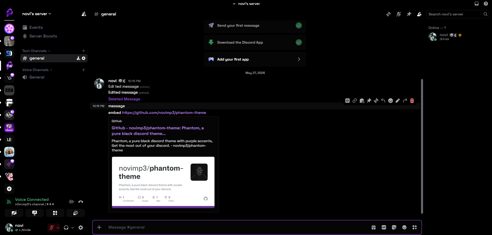

# phantom 🌌

pure black with electric purple vibes. 

### preview

### 📌 features
* **pure amoled black:** everything is pitch black, not that weird default dark gray.
* **electric purple:** clean accents for pings, hovers, and unreads.
* **clean fonts:** space grotesk with heavy bold weights.

### 🛠️ how to use (vencord / vesktop / betterdiscord)
1. copy the link to the `phantom.theme.css` file in this repo (click "raw" first so you get the direct link).
2. open your client settings and go to **themes**.
3. paste the link into the online themes section and load it.

alternative method
1. copy this link https://raw.githubusercontent.com/novimp3/phantom-theme/main/phantom.theme.css
2. go to your client's themes tab
3. paste the link in "online themes" 

### 🌐 website

### note
this code is fully open source and you can fork it as long as you will give me and luckfire credits.

### 🤝 credits
massive credits to **luckfire** for creating **amoled-cord**. this is heavily based on/inspired by their work.

huge thank you to [**artbm172**](https://github.com/artbm172) for helping debug and fix the theme.

enjoy ✌️
